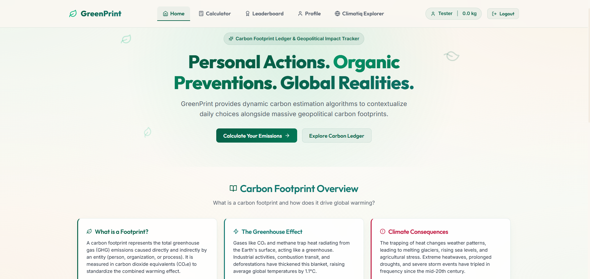
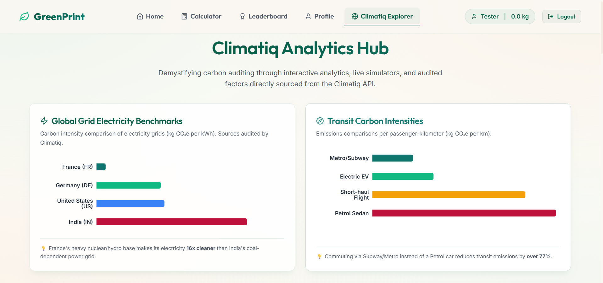
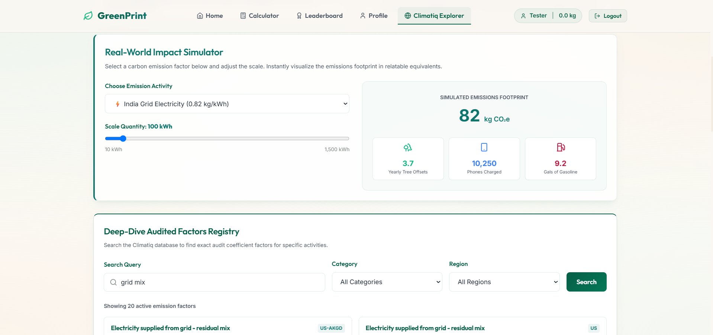
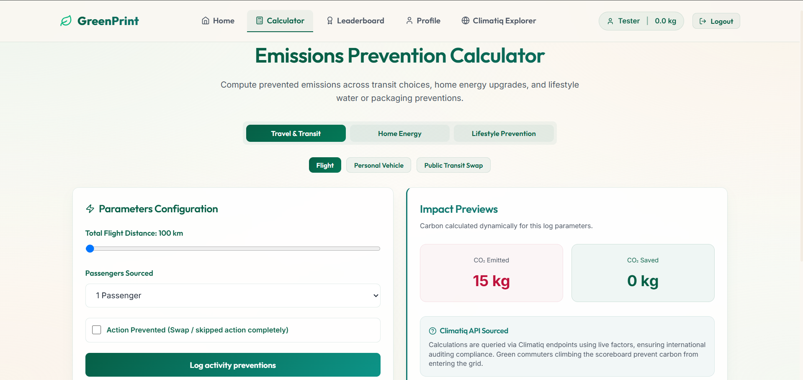
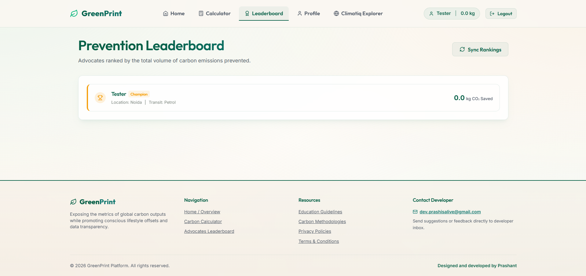
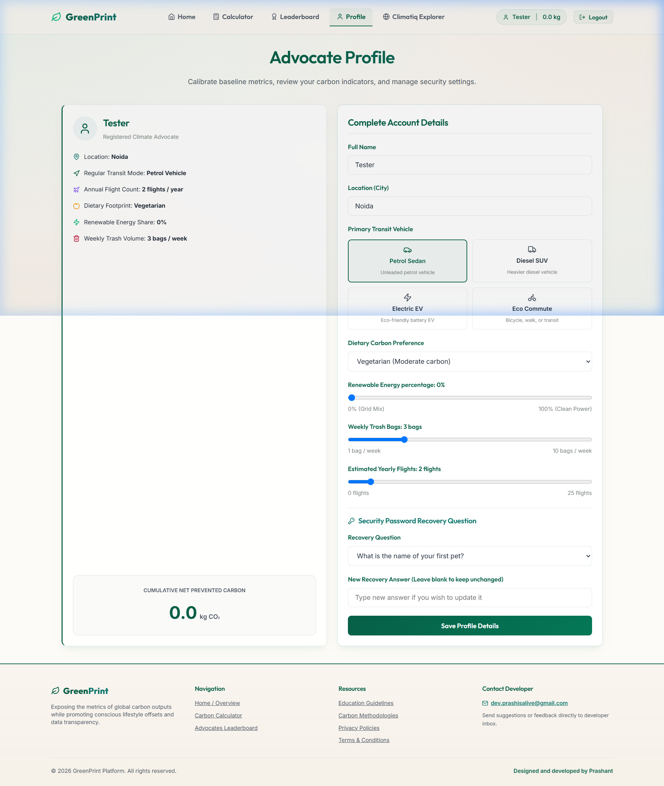

# 🍃 GreenPrint

🚀 **Live Deployment:** [https://greenprint-1cma.onrender.com](https://greenprint-1cma.onrender.com)

GreenPrint is a state-of-the-art climate ledger and geopolitical carbon footprint tracker. It enables individuals to estimate, simulate, and log personal carbon offsets and emissions, while contrasting their footprint with large-scale global realities.

GreenPrint integrates a dual-mode database engine (Supabase Postgres with local JSON mock persistent fallback) and queries live auditing carbon coefficients directly using the **Climatiq API**.

---

## 📸 Interface Preview

### 1. Home Dashboard & Geopolitical Contrast
*Expose the metrics of personal choices side-by-side with military and geopolitical carbon footprints.*


### 2. Live Climatiq Explorer
*Query the Climatiq database in real time for audited factors across regions and categories.*



### 3. Net Carbon Calculator & Simulator
*Dynamically estimate emissions and equivalents (trees, smartphones charged, gasoline gallons).*


### 4. Advocates Leaderboard
*Compare achievements and climb the rankings based on true net carbon saved.*


### 5. Advocate Profile
*Calibrate baseline averages, manage custom lifestyle details (diet, waste, renewable energy), and configure secure recovery questions.*


---

## ⚡ Core Features

- **Net Carbon Calculations**: Calculates user score on the leaderboard based on the net saving logic: $\text{Net Carbon Saved} = \text{Total Saved} - \text{Total Emitted}$.
- **Rich Advocate Profiles**: Includes custom indicators for dietary footprint (plant-based, vegetarian, meat-heavy), home renewable energy mix, weekly waste generation, and live recovery question updates.
- **Climatiq API Integration**: Queries official auditing carbon coefficient factors directly from the Climatiq `/data/v1/estimate` and `/data/v1/search` endpoints.
- **Interactive Impact Simulator**: Select from Indian, US, or French grid mix benchmarks and see the impact in trees required, phones charged, or gallons of gasoline burned.
- **Secure Authentication**: Includes hashed passwords/security question answers using `bcryptjs` and secure tokens via `jsonwebtoken` (JWT).
- **Dual-Mode Persistence**: Uses Supabase Postgres DB, with a zero-configuration local JSON database fallback (`data/db_store/`) for offline development.
- **Responsive Layout**: Designed from scratch using custom, premium CSS styles with a warm organic mesh gradient background, glassmorphic panels, and smooth animations.

---

## 🛠️ Tech Stack

- **Frontend**: React 19, Vite, Recharts, Lucide Icons
- **Backend**: Node.js, Express, JWT
- **Databases**: Supabase (PostgreSQL) / JSON fallback engine
- **Carbon APIs**: Climatiq API (v1 / data v3)

---

## 🚀 Local Installation

### Prerequisites
- Node.js (v18+)
- npm

### 1. Clone the repository
```bash
git clone https://github.com/Prash-code9428/GreenPrint.git
cd GreenPrint
```

### 2. Configure Environment Variables
Create a `.env` file in the `backend` directory:
```env
SUPABASE_URL=your_supabase_project_url
SUPABASE_KEY=your_supabase_anon_key
CLIMATIQ_API_KEY=your_climatiq_api_token
JWT_SECRET=your_jwt_signature_secret
PORT=5000
```

### 3. Install & Start Development Servers

#### Backend:
```bash
cd backend
npm install
npm run dev
```

#### Frontend:
```bash
cd ../frontend
npm install
npm run dev
```

The application will be running locally at `http://localhost:5173/` and proxied to the server API on port `5000`.

---

## 🌍 Hosting on Render

### 1. Backend Web Service
1. Create a new **Web Service** on Render pointing to your repository.
2. Set the root directory to `backend`.
3. Build Command: `npm install`
4. Start Command: `npm start`
5. Configure environment variables in Render:
   * `SUPABASE_URL`, `SUPABASE_KEY`, `CLIMATIQ_API_KEY`, `JWT_SECRET`.

### 2. Frontend Static Site
1. Create a new **Static Site** on Render pointing to your repository.
2. Set the root directory to `frontend`.
3. Build Command: `npm run build`
4. Publish Directory: `dist`
5. Configure the environment variable:
   * `VITE_API_URL` = Your backend web service URL (e.g. `https://greenprint-backend.onrender.com`).

